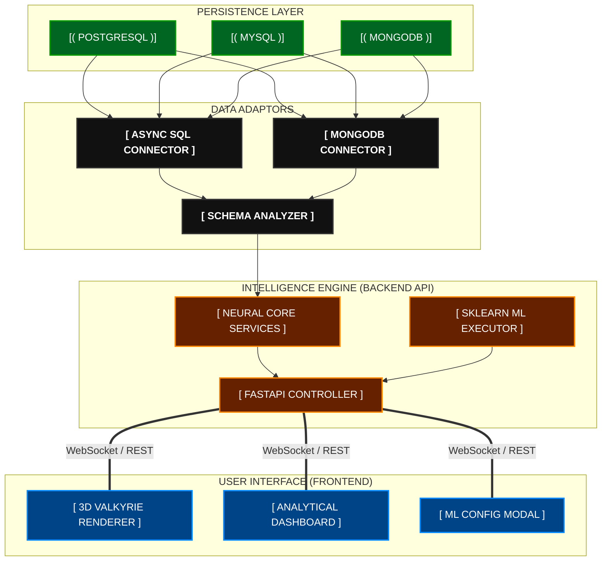
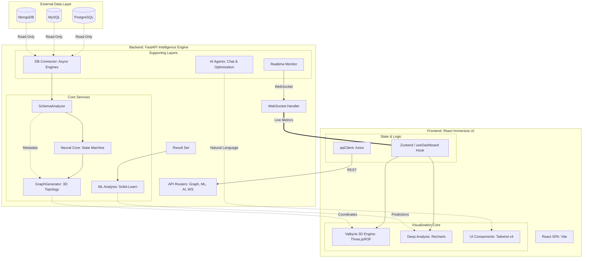

# 🏛️ Full Stack System Architecture: Block Diagram

> [!TIP]
> **How to see these diagrams in VS Code:**
> Press **`Ctrl + Shift + V`** on your keyboard to open the **Markdown Preview** window!

## ⬛ High-Level Block View (Image)

## 🏗️ Interactive Functional Blueprint

---

## 🎨 3D Isometric Ecosystem

---
**One Complete View — Mapping the intelligence of data in 3D space.**
