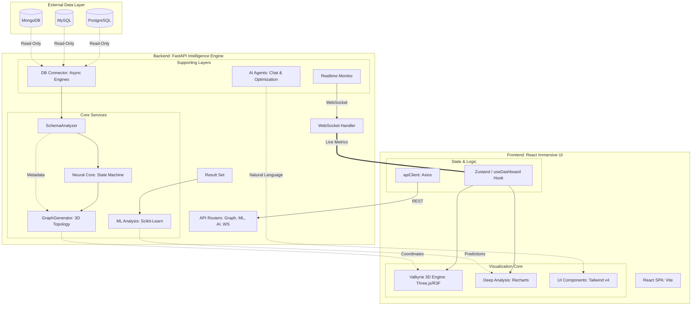

# 🏛️ Complete System Architecture: Living Data Intelligence Platform

This document provides a unified architectural blueprint of the entire repository, mapping the flow from raw database ingestion to immersive 3D visualization and real-time ML analysis.

---

## 1. High-Level Architecture Diagram (Full Repo)

---

## 2. Component Directory

### 2.1 External Data Layer
- **Read-Only Ingestion**: The system connects as a passive observer using asynchronous drivers (`asyncpg`, `aiomysql`, `motor`).
- **Metadata Extraction**: Scans schema catalogues to build the platform's internal `SchemaDefinition`.

### 2.2 Backend Intelligence Engine
- **Neural Core (`backend/app/services/neural_core`)**: Simulates a synthetic learning state, calculating node "vitality," "entropy," and "gravity."
- **Graph Generator (`backend/app/services/graph_generator.py`)**: Computes 3D clustering using Louvain Modularity and PCA-based relative positioning.
- **ML Analysis (`backend/app/api/ml_analysis.py`)**: Handles real-time scikit-learn training for classification and regression.
- **WebSocket Pipeline (`backend/app/api/websocket.py`)**: Streams metrics at 500ms intervals to keep the frontend "alive."

### 2.3 Frontend Immersive UI
- **Valkyrie Engine (`frontend/src/components/Dashboard/ThreeGraph.jsx`)**: Renders the 3D topology at 60fps using React-Three-Fiber.
- **Zustand Store (`frontend/src/hooks/useDashboard.js`)**: The "Single Source of Truth" managing graph state, selection, and interactive commands.
- **Analytical Layers**: `DeepAnalysisPage.jsx` provides 2D/3D statistical drill-downs of specific tables.

---

## 3. Data Flow Lineage

1.  **Discovery**: `SchemaAnalyzer` detects tables and foreign key relationships.
2.  **Simulation**: `NeuralCore` initializes metrics.
3.  **Visualization**: `GraphGenerator` sends nodes/edges to the Frontend.
4.  **Interaction**: User clicks a node; `useDashboard` triggers an AI query or ML analysis.
5.  **Feedback**: `RealtimeMonitor` sends pulse signals back through the WebSocket, causing the 3D node to "breathe."

---
**One Complete View — Mapping the intelligence of data in 3D space.**
