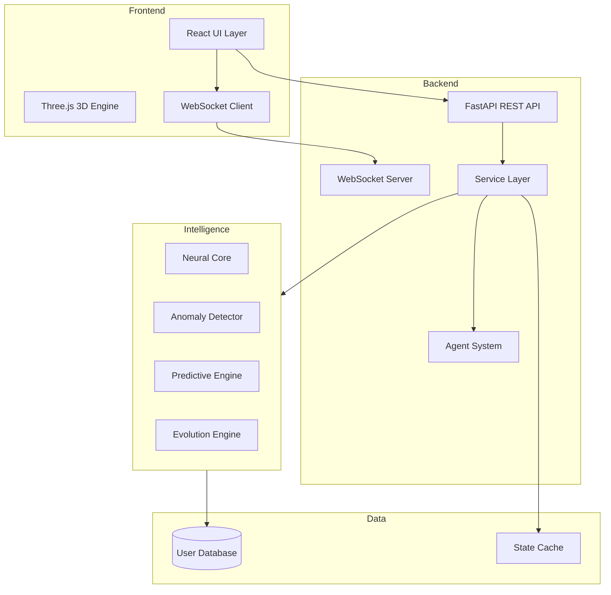
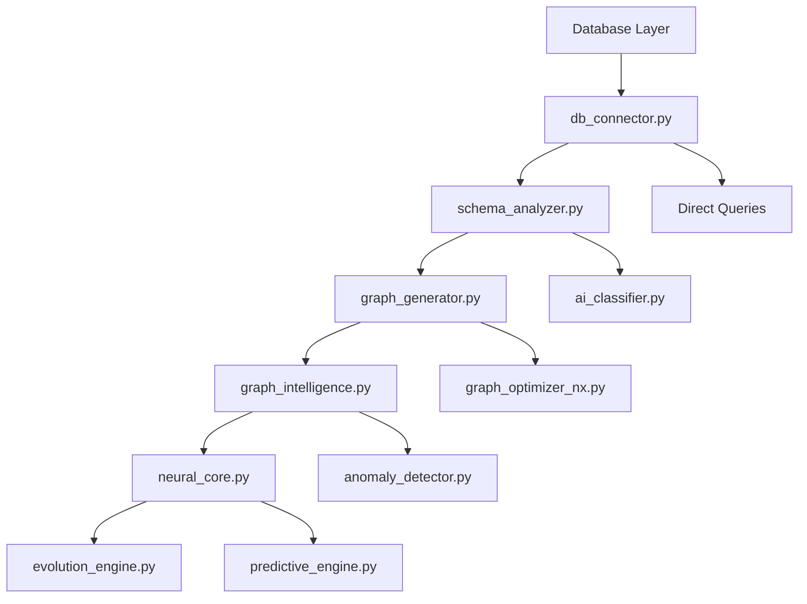
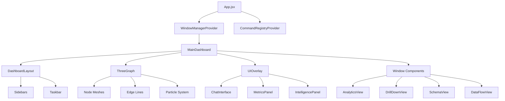
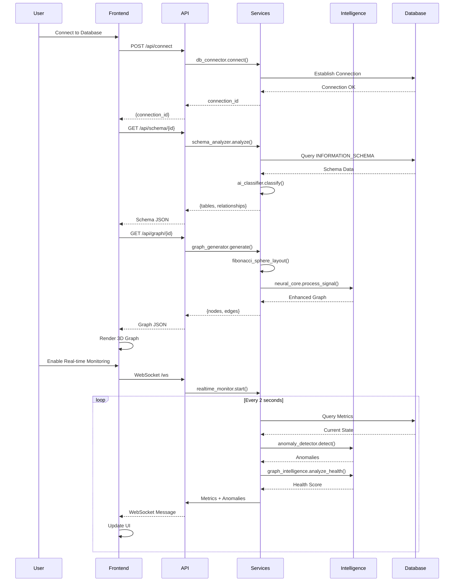

# 📘 Living Data Intelligence Platform - Complete Technical Documentation

**Version**: 1.0  
**Last Updated**: February 10, 2026  
**Branch**: sai

---

## 📑 Table of Contents

1. [System Overview](#system-overview)
2. [Architecture & Design Patterns](#architecture--design-patterns)
3. [Backend Services (43 Services)](#backend-services)
4. [Frontend Components (20+ Components)](#frontend-components)
5. [Mathematical Formulas & Algorithms](#mathematical-formulas--algorithms)
6. [API Endpoints (14+ Endpoints)](#api-endpoints)
7. [Data Flow & Processing Pipeline](#data-flow--processing-pipeline)
8. [Feature-to-Code Mapping](#feature-to-code-mapping)
9. [Database Schema & Models](#database-schema--models)
10. [Configuration & Environment](#configuration--environment)

---

## 🎯 System Overview

### What is Living Data Intelligence?

A **next-generation database visualization and intelligence platform** that transforms relational databases into interactive 3D "living organisms" with real-time monitoring, AI-powered insights, and natural language interaction.

### Core Philosophy

- **Reality-Driven**: All intelligence derived from actual database state, not synthetic data
- **Immutable State Chain**: System evolution tracked through immutable state deltas
- **Explainable AI**: Every AI decision includes natural language explanations
- **Living Graph**: Database visualized as a breathing, evolving organism

### Technology Stack

| Layer | Technologies |
|-------|-------------|
| **Backend** | FastAPI, Uvicorn (ASGI), Python 3.8+ |
| **Frontend** | React 19, Three.js, React-Three-Fiber, Vite |
| **Styling** | TailwindCSS v4, Framer Motion |
| **AI/ML** | Google Gemini, Groq, NumPy, scikit-learn, NetworkX |
| **Databases** | PostgreSQL, MySQL, MongoDB |
| **Real-time** | WebSockets, Server-Sent Events |

---

## 🏗️ Architecture & Design Patterns

### System Architecture



### Design Patterns Used

#### 1. **Singleton Pattern**
All major services use singleton instances for global state management:

```python
# Example from neural_core.py
neural_core = NeuralCore()  # Global instance

# Example from anomaly_detector.py
anomaly_detector = AnomalyDetector()  # Global instance
```

**Services using Singleton:**
- `neural_core` - Neural Core intelligence
- `anomaly_detector` - Anomaly detection
- `graph_intelligence` - Graph health management
- `predictive_engine` - Forecasting
- `evolution_engine` - Time-based evolution
- `data_quality_engine` - Quality scoring
- `gravity_engine` - Physics calculations
- `latent_space_service` - Latent space mapping

#### 2. **Service Layer Pattern**
Business logic separated from API routes:

```
app/
├── api/          # Route handlers (thin layer)
│   ├── graph.py
│   ├── intelligence.py
│   └── ...
└── services/     # Business logic (thick layer)
    ├── graph_generator.py
    ├── neural_core.py
    └── ...
```

#### 3. **Agent Pattern (T0/T1 Architecture)**

```python
# T0 Agent: Intent Understanding
class T0Agent:
    """Translates natural language to commands"""
    
# T1 Agent: Action Execution
class T1Agent:
    """Executes platform actions"""
```

**Flow:**
```
User Voice → Intent Classifier → T0 Agent → Command → T1 Agent → Action
```

#### 4. **State Management Pattern**

```python
@dataclass
class StateDelta:
    """Immutable state snapshot"""
    timestamp: str
    connection_id: str
    patterns_learned: int
    signal_count: int
    node_states: Dict[str, Dict[str, Any]]
    edge_states: Dict[str, Dict[str, Any]]
```

#### 5. **Observer Pattern**
WebSocket-based real-time updates:

```python
# Backend broadcasts state changes
await websocket.send_json({
    "type": "metrics_update",
    "data": metrics
})

# Frontend observes and updates UI
ws.onmessage = (event) => {
    const data = JSON.parse(event.data);
    updateMetrics(data);
}
```

---

## 🔧 Backend Services

### Service Hierarchy & Inheritance



### Complete Service Catalog (43 Services)

| # | Service | Purpose | Key Methods | Dependencies |
|---|---------|---------|-------------|--------------|
| 1 | `db_connector.py` | Database connection management | `connect()`, `query()`, `get_connection()` | psycopg2, pymongo, pymysql |
| 2 | `schema_analyzer.py` | Schema introspection | `analyze_schema()`, `get_relationships()` | db_connector |
| 3 | `ai_classifier.py` | Table classification (Fact/Dimension) | `classify_table()`, `classify_all()` | schema_analyzer |
| 4 | `graph_generator.py` | 3D graph generation | `generate_graph()`, `fibonacci_sphere()` | schema_analyzer, ai_classifier |
| 5 | `graph_intelligence.py` | Health scoring & vitality | `analyze_graph_health()`, `calculate_node_vitality()` | - |
| 6 | `graph_optimizer_nx.py` | NetworkX clustering | `optimize_graph()`, `louvain_clustering()` | networkx, python-louvain |
| 7 | `neural_core.py` | Neural simulation engine | `process_signal()`, `predict_links()`, `emit_state()` | - |
| 8 | `anomaly_detector.py` | Statistical anomaly detection | `detect_anomalies()`, `_zscore_analysis()` | statistics |
| 9 | `predictive_engine.py` | Time-series forecasting | `forecast_table_growth()` | numpy |
| 10 | `evolution_engine.py` | Historical state generation | `get_snapshot()`, `generate_keyframes()` | temporal_analyzer |
| 11 | `data_quality_engine.py` | Data quality scoring | `calculate_quality_score()`, `detect_duplicates()` | - |
| 12 | `gravity_engine.py` | Physics-based positioning | `calculate_gravity()` | sklearn, pandas |
| 13 | `latent_space_service.py` | Latent space mapping | `calculate_latent_coordinates()`, `generate_manifold_data()` | neural_core |
| 14 | `realtime_monitor.py` | Real-time metrics streaming | `start_monitoring()`, `generate_metrics()` | websockets |
| 15 | `chat_service.py` | AI chat processing | `process_message()`, `generate_response()` | google.generativeai, groq |
| 16 | `intent_classifier.py` | Voice command classification | `classify()`, `_classify_llm()` | groq, google.generativeai |
| 17 | `t0_agent.py` | Intent understanding agent | `process_command()`, `translate_to_action()` | intent_classifier |
| 18 | `t1_agent.py` | Action execution agent | `execute_action()`, `_handle_*()` methods | agent_state_manager |
| 19 | `agent_service.py` | Agent orchestration | `process_voice_command()`, `get_agent_status()` | t0_agent, t1_agent |
| 20 | `agent_state_manager.py` | Agent state tracking | `update_state()`, `get_state()` | - |
| 21 | `agent_analyst.py` | Autonomous analysis | `analyze_patterns()`, `generate_insights()` | - |
| 22 | `action_policy.py` | Agent action rules | `evaluate_policy()`, `get_allowed_actions()` | - |
| 23 | `command_registry.py` | Command registration | `register_command()`, `get_command()` | - |
| 24 | `data_flow_analyzer.py` | Data flow analysis | `analyze_flow()`, `trace_lineage()` | schema_analyzer |
| 25 | `hierarchical_flow.py` | Hierarchy mapping | `build_hierarchy()`, `get_parent_child()` | schema_analyzer |
| 26 | `drill_down.py` | Table drill-down logic | `get_drill_down_data()`, `circle_packing()` | db_connector |
| 27 | `pattern_analyzer.py` | Pattern detection | `detect_patterns()`, `find_correlations()` | - |
| 28 | `root_cause_analyzer.py` | Root cause analysis | `analyze_root_cause()`, `trace_impact()` | - |
| 29 | `recommendation_engine.py` | Recommendation generation | `generate_recommendations()`, `score_suggestions()` | - |
| 30 | `temporal_analyzer.py` | Temporal analysis | `analyze_evolution()`, `detect_trends()` | db_connector |
| 31 | `time_machine.py` | Time-travel functionality | `rewind_to()`, `fast_forward()` | evolution_engine |
| 32 | `living_graph_engine.py` | Living behaviors | `update_living_state()`, `apply_behaviors()` | graph_intelligence |
| 33 | `metrics_service.py` | Metrics collection | `collect_metrics()`, `aggregate_metrics()` | - |
| 34 | `memory_service.py` | State persistence | `save_state()`, `load_state()` | - |
| 35 | `cluster_store.py` | Clustering persistence | `save_clusters()`, `load_clusters()` | - |
| 36 | `connection_manager.py` | WebSocket management | `connect()`, `broadcast()`, `disconnect()` | websockets |
| 37 | `intelligence_engine.py` | Intelligence orchestration | `run_intelligence()`, `aggregate_insights()` | multiple services |
| 38 | `analysis_engine.py` | Analysis orchestration | `run_analysis()`, `generate_report()` | multiple services |
| 39 | `rl_optimizer.py` | Reinforcement learning | `optimize()`, `update_policy()` | - |
| 40 | `seeder.py` | Database seeding | `seed_database()`, `generate_sample_data()` | db_connector |
| 41 | `causal_intelligence.py` | Causal analysis | `infer_causality()`, `build_causal_graph()` | - |
| 42 | `data_intelligence_analyzer.py` | Deep data analysis | `analyze_intelligence()`, `extract_insights()` | multiple services |
| 43 | `utils/helpers.py` | Utility functions | Various helper functions | - |

---

## 🎨 Frontend Components

### Component Hierarchy



### Complete Component Catalog

#### Dashboard Components (11)

| Component | File | Purpose | Key Features |
|-----------|------|---------|--------------|
| **ThreeGraph** | `ThreeGraph.jsx` | Main 3D visualization | Fibonacci sphere layout, particle system, node interactions |
| **AnalyticsView** | `AnalyticsView.jsx` | Analytics dashboard | Charts, metrics, insights display |
| **ChatInterface** | `ChatInterface.jsx` | AI chat interface | Natural language queries, markdown rendering |
| **DataFlowView** | `DataFlowView.jsx` | Data flow visualization | Flow diagrams, lineage tracing |
| **DrillDownView** | `DrillDownView.jsx` | Table drill-down | Circle packing layout, column details |
| **SchemaView** | `SchemaView.jsx` | Schema explorer | Hierarchical tree, relationship viewer |
| **UIOverlay** | `UIOverlay.jsx` | Main UI overlay | Controls, status, notifications |
| **IntelligencePanel** | `IntelligencePanel.jsx` | Intelligence insights | AI recommendations, patterns |
| **EdgeStatsPanel** | `EdgeStatsPanel.jsx` | Edge statistics | Relationship metrics |
| **Record3DGraph** | `Record3DGraph.jsx` | Record-level 3D view | Individual record visualization |
| **RecordForceGraph** | `RecordForceGraph.jsx` | Force-directed record graph | Physics-based record layout |

#### Intelligence Components (9)

| Component | File | Purpose |
|-----------|------|---------|
| **AnomalyDashboard** | `AnomalyDashboard.jsx` | Anomaly detection display |
| **HealthDashboard** | `HealthDashboard.jsx` | System health monitoring |
| **PredictionDashboard** | `PredictionDashboard.jsx` | Predictive analytics |
| **PatternDashboard** | `PatternDashboard.jsx` | Pattern detection results |
| **RecommendationDashboard** | `RecommendationDashboard.jsx` | AI recommendations |
| **RootCauseDashboard** | `RootCauseDashboard.jsx` | Root cause analysis |
| **DeepStatusDashboard** | `DeepStatusDashboard.jsx` | Deep system status |
| **IntelligenceHub** | `IntelligenceHub.jsx` | Central intelligence hub |
| **BlueprintOverlay** | `BlueprintOverlay.jsx` | System blueprint view |

#### Evolution Components (4)

| Component | File | Purpose |
|-----------|------|---------|
| **TimelinePlayer** | `TimelinePlayer.jsx` | Time-travel controls |
| **EvolutionOverlay** | `EvolutionOverlay.jsx` | Evolution visualization |
| **EvolutionMathOverlay** | `EvolutionMathOverlay.jsx` | Mathematical evolution display |
| **EvolutionControls** | (embedded) | Playback controls |

#### Voice Components (2)

| Component | File | Purpose |
|-----------|------|---------|
| **VoiceControl** | `VoiceControl.jsx` | Voice command interface |
| **AgentStatusPanel** | `AgentStatusPanel.jsx` | Agent status display |

#### Layout Components (3)

| Component | File | Purpose |
|-----------|------|---------|
| **DashboardLayout** | `DashboardLayout.jsx` | Main layout structure |
| **Sidebars** | `Sidebars.jsx` | Left/right sidebars |
| **Taskbar** | `Taskbar.jsx` | Bottom taskbar |

#### Window Manager (3)

| Component | File | Purpose |
|-----------|------|---------|
| **WindowManagerProvider** | `WindowManagerContext.jsx` | Window state management |
| **Window** | (embedded) | Draggable window wrapper |
| **WindowControls** | (embedded) | Minimize/maximize/close |

---

## 📐 Mathematical Formulas & Algorithms

### 1. Health Scoring Algorithm

**Location:** `backend/app/services/graph_intelligence.py`

```python
# Initial Score
health_score = 100

# Deductions
if tx_rate > 1200:
    health_score -= 20  # High load penalty
elif tx_rate < 100:
    health_score -= 10  # Low activity penalty

if fraud_alerts > 5:
    health_score -= 30  # Critical fraud penalty
elif fraud_alerts > 0:
    health_score -= 10  # Warning fraud penalty

if failed_tx > 30:
    health_score -= 25  # High failure penalty
elif failed_tx > 10:
    health_score -= 10  # Elevated failure penalty

# State Classification
if health_score >= 80:
    state = "healthy"    # Green
elif health_score >= 50:
    state = "stressed"   # Yellow
else:
    state = "anomalous"  # Red
```

**Formula:**
```
Health Score = 100 - Σ(penalties)

Where penalties ∈ {
    load_penalty: [0, 10, 20]
    fraud_penalty: [0, 10, 30]
    failure_penalty: [0, 10, 25]
}
```

### 2. Node Vitality Calculation

**Location:** `backend/app/services/graph_intelligence.py`

```python
# Logarithmic scaling for row count
if row_count > 0:
    base_vitality = min(100, 30 + (log10(row_count) * 14))
else:
    base_vitality = 25

# Entity-based multiplier
multipliers = {
    'transaction': 1.5,
    'fraud': 1.2 + (fraud_alerts / 10),
    'other': 1.0
}

vitality = min(100, base_vitality * multiplier)

# Derived properties
pulse_rate = 0.5 + (vitality / 100) * 1.5      # 0.5-2.0 seconds
glow_intensity = 0.3 + (vitality / 100) * 0.7  # 0.3-1.0
size_modifier = 1.2 if vitality > 80 else (0.8 if vitality < 30 else 1.0)
```

**Formula:**
```
Vitality = min(100, (30 + 14·log₁₀(N)) · M)

Where:
  N = row_count
  M = entity_multiplier ∈ [1.0, 1.5]

Pulse Rate = 0.5 + 1.5·(V/100)
Glow = 0.3 + 0.7·(V/100)
Size = { 1.2 if V>80, 0.8 if V<30, 1.0 otherwise }
```

### 3. Z-Score Anomaly Detection

**Location:** `backend/app/services/anomaly_detector.py`

```python
# Statistical baseline
mean = statistics.mean(history)
stdev = statistics.stdev(history) if len(history) > 1 else 0.1
stdev = max(stdev, noise_floor)  # noise_floor = 0.1

# Z-score calculation
z_score = abs((current_value - mean) / stdev)

# Anomaly classification
if z_score > 3.0:
    severity = "High" if z_score > 5 else "Medium"
    return {
        'metric': metric,
        'current_value': current_value,
        'expected_value': mean,
        'z_score': z_score,
        'severity': severity
    }
```

**Formula:**
```
Z = |X - μ| / σ

Where:
  X = current_value
  μ = mean(history)
  σ = max(stdev(history), 0.1)

Anomaly if Z > 3.0
Severity = { "High" if Z>5, "Medium" if 3<Z≤5 }
```

### 4. Gravity Engine (PCA + K-Means)

**Location:** `backend/app/services/gravity_engine.py`

```python
# 1. Normalize data
X = StandardScaler().fit_transform(df_encoded)

# 2. K-Means clustering
kmeans = KMeans(n_clusters=min(5, len(df)), random_state=42)
clusters = kmeans.fit_predict(X)

# 3. PCA for 3D projection
pca = PCA(n_components=3)
coords = pca.fit_transform(X)  # [x, y, z]

# 4. Gravity score (inverse distance from origin)
distances = np.linalg.norm(X, axis=1)
max_dist = np.max(distances) if np.max(distances) > 0 else 1
gravity_scores = [(1 - (d / max_dist)) * 100 for d in distances]

# 5. Position scaling
pos_x = coords[i][0] * 50
pos_y = coords[i][1] * 50
pos_z = coords[i][2] * 50
```

**Formula:**
```
Gravity Score = (1 - ||X||/||X||_max) · 100

PCA Projection: X' = W^T · (X - μ)
Where W are top-3 eigenvectors

Position = PCA_coords · 50
```

### 5. Latent Space Mapping

**Location:** `backend/app/services/latent_space_service.py`

```python
# Business entity-based zoning
entity_zones = {
    'customer': -11000,    # Green Mountain
    'transaction': -3500,  # Blue Mountain
    'product': 3500,       # Yellow Mountain
    'fraud': 11000         # Red Mountain
}

base_x = entity_zones.get(business_entity, 0)
cluster_jitter = (hash(cluster_id) % 2500) - 1250
row_log = log10(max(1, row_count)) * 150

# X-axis (VALUE)
latent_x = base_x + cluster_jitter + row_log

# Y-axis (RISK) - Majestic peaks
latent_y = (importance * 1200.0) + (max_z_score * 1800.0)

# Z-axis (STABILITY)
vitality_normalized = vitality / 100.0
latent_z = (vitality_normalized - 0.5) * z_gain * 8.0
```

**Formula:**
```
X (VALUE) = Zone_base + Jitter + 150·log₁₀(N)
Y (RISK) = 1200·I + 1800·Z_max
Z (STABILITY) = 8·z_gain·(V/100 - 0.5)

Where:
  Zone_base ∈ {-11000, -3500, 3500, 11000}
  Jitter ∈ [-1250, 1250]
  I = importance ∈ [0, 1]
  Z_max = max z-score from anomalies
  V = vitality ∈ [0, 100]
```

### 6. Motion Analysis (Velocity & Acceleration)

**Location:** `backend/app/services/latent_space_service.py`

```python
# Velocity (rate of change)
dt = max(0.1, now - prev_time)
vx = (current_x - prev_x) / dt
vy = (current_y - prev_y) / dt
vz = (current_z - prev_z) / dt
v_magnitude = sqrt(vx² + vy² + vz²)

# Acceleration (change in velocity)
dv = v_magnitude - prev_v_magnitude
acceleration = dv / dt

# Motion pattern classification
if v_magnitude < 1.0:
    pattern = 'stable'
elif vy > 20.0:
    pattern = 'collapsing'  # Sharp risk increase
elif acceleration > 10.0:
    pattern = 'accelerating'
else:
    pattern = 'drifting'
```

**Formula:**
```
v⃗ = Δr⃗/Δt = (r⃗_current - r⃗_prev) / Δt

|v⃗| = √(vx² + vy² + vz²)

a = Δ|v⃗|/Δt = (|v⃗|_current - |v⃗|_prev) / Δt

Pattern = {
    'stable' if |v⃗| < 1
    'collapsing' if vy > 20
    'accelerating' if a > 10
    'drifting' otherwise
}
```

### 7. Evolution Snapshot (Logistic Growth)

**Location:** `backend/app/services/evolution_engine.py`

```python
# Time calculations
days_active = (target_time - birth_date).days + (seconds / 86400)
total_history_days = max(1, (now - birth_date).days)
growth_progress = min(1.0, days_active / total_history_days)

# Logistic-style growth with acceleration
estimated_count = int(current_size * (growth_progress ** 1.2))
estimated_count = min(current_size, max(1, estimated_count))

# Age factor (brightness decay)
age_days = max(0, (target_time - birth_date).days)
age_factor = max(0.2, 1.0 - (age_days / 180))  # Dim over 6 months

# Vitality calculation
n_term = log10(estimated_count + 1)
node_glow = (0.8 * n_term * age_factor) + (0.6 * importance)
vitality = min(100, (n_term * 20) + (importance * 5))
```

**Formula:**
```
N(t) = N_max · (t/T)^α

Where:
  N_max = current_size
  t = days_active
  T = total_history_days
  α = 1.2 (acceleration factor)

Age Factor = max(0.2, 1 - t_age/180)

Glow = 0.8·log₁₀(N+1)·Age + 0.6·I
Vitality = min(100, 20·log₁₀(N+1) + 5·I)
```

### 8. Fibonacci Sphere Layout

**Location:** `backend/app/services/graph_generator.py`

```python
golden_ratio = (1 + sqrt(5)) / 2
golden_angle = 2 * pi * (1 - 1/golden_ratio)

for i in range(n):
    # Latitude (y-coordinate)
    y = 1 - (i / (n - 1)) * 2
    
    # Radius at this latitude
    radius_at_y = sqrt(1 - y * y)
    
    # Longitude
    theta = golden_angle * i
    
    # Cartesian coordinates
    x = cos(theta) * radius_at_y
    z = sin(theta) * radius_at_y
    
    # Scale to desired radius
    position = (x * R, y * R, z * R)
```

**Formula:**
```
φ = (1 + √5) / 2  (golden ratio)
θ_golden = 2π(1 - 1/φ) ≈ 2.399963...

For node i ∈ [0, n-1]:
  y_i = 1 - 2i/(n-1)
  r_i = √(1 - y_i²)
  θ_i = i · θ_golden
  
  x_i = R · r_i · cos(θ_i)
  y_i = R · y_i
  z_i = R · r_i · sin(θ_i)
```

### 9. Data Quality Score

**Location:** `backend/app/services/data_quality_engine.py`

```python
# Component scores (0-100 each)
completeness = score_completeness(sample_data, columns)
accuracy = score_accuracy(sample_data, columns)
consistency = score_consistency(sample_data, columns)
timeliness = score_timeliness(db_connector, connection_id, table_name, columns)

# Weighted average
quality_score = (
    completeness * 0.30 +
    accuracy * 0.30 +
    consistency * 0.25 +
    timeliness * 0.15
)
```

**Formula:**
```
Quality Score = 0.30·C + 0.30·A + 0.25·K + 0.15·T

Where:
  C = Completeness (% non-null)
  A = Accuracy (% valid formats)
  K = Consistency (format uniformity)
  T = Timeliness (data freshness)
```

### 10. Predictive Growth Forecast

**Location:** `backend/app/services/predictive_engine.py`

```python
# Linear regression on historical data
if len(history) >= 2:
    # Calculate growth rate
    days = [(h['date'] - history[0]['date']).days for h in history]
    counts = [h['row_count'] for h in history]
    
    # Simple linear fit
    growth_rate = (counts[-1] - counts[0]) / (days[-1] - days[0])
    
    # Forecast
    forecast_days = 30
    predicted_count = counts[-1] + (growth_rate * forecast_days)
    
    growth_pct = ((predicted_count - counts[-1]) / counts[-1]) * 100
```

**Formula:**
```
Growth Rate = ΔN / Δt = (N_final - N_initial) / (t_final - t_initial)

Prediction(t) = N_current + r · Δt

Growth % = ((N_predicted - N_current) / N_current) · 100
```

---

## 🌐 API Endpoints

### Complete API Reference

#### Database Management

| Method | Endpoint | Purpose | Request Body | Response |
|--------|----------|---------|--------------|----------|
| POST | `/api/connect` | Create database connection | `{type, host, port, database, user, password}` | `{connection_id, status}` |
| GET | `/api/connections` | List all connections | - | `[{id, type, database, status}]` |
| DELETE | `/api/connections/{id}` | Remove connection | - | `{success: true}` |
| GET | `/api/schema/{connection_id}` | Get database schema | - | `{tables: [...], relationships: [...]}` |

#### Graph & Visualization

| Method | Endpoint | Purpose | Request Body | Response |
|--------|----------|---------|--------------|----------|
| GET | `/api/graph/{connection_id}` | Get 3D graph data | - | `{nodes: [...], edges: [...]}` |
| POST | `/api/graph/data` | Get graph with filters | `{connection_id, filters}` | `{nodes: [...], edges: [...]}` |
| POST | `/api/optimize` | Apply clustering | `{connection_id, method: "heuristic"\|"networkx"}` | `{clusters: [...]}` |
| POST | `/api/gravity/calculate` | Calculate positions | `{connection_id, table, column}` | `{records: [...]}` |

#### Analytics & Intelligence

| Method | Endpoint | Purpose | Request Body | Response |
|--------|----------|---------|--------------|----------|
| GET | `/api/metrics/live` | Real-time metrics stream | - | WebSocket stream |
| POST | `/api/ai/classify` | Classify table types | `{connection_id, tables}` | `{classifications: [...]}` |
| POST | `/api/ai/chat` | Natural language query | `{message, connection_id}` | `{response, actions}` |
| GET | `/api/data-flow/{table_name}` | Get data flow | - | `{flow: [...], lineage: [...]}` |
| GET | `/api/hierarchy/{table_name}` | Get hierarchy | - | `{parent: ..., children: [...]}` |

#### Drill-Down & Exploration

| Method | Endpoint | Purpose | Request Body | Response |
|--------|----------|---------|--------------|----------|
| GET | `/api/drilldown/{connection_id}/{table}` | Table drill-down | - | `{columns: [...], sample_data: [...]}` |
| POST | `/api/intelligence/analyze` | Run intelligence | `{connection_id, type}` | `{insights: [...]}` |
| GET | `/api/evolution/snapshot` | Get time snapshot | `?connection_id&timestamp` | `{snapshot: {...}}` |
| GET | `/api/evolution/keyframes` | Get animation frames | `?connection_id&steps=50` | `{keyframes: [...]}` |

#### Agent System

| Method | Endpoint | Purpose | Request Body | Response |
|--------|----------|---------|--------------|----------|
| POST | `/api/agent/command` | Execute voice command | `{command, context}` | `{result, actions}` |
| GET | `/api/agent/status` | Get agent status | - | `{t0_state, t1_state}` |
| POST | `/api/agent/register` | Register custom action | `{action, handler}` | `{success: true}` |

#### WebSocket Endpoints

| Endpoint | Purpose | Message Format |
|----------|---------|----------------|
| `/ws` | Real-time metrics | `{type: "metrics_update", data: {...}}` |
| `/ws/agent` | Agent communication | `{type: "command", payload: {...}}` |

---

## 🔄 Data Flow & Processing Pipeline

### Complete Data Flow Diagram



### Processing Pipeline Stages

#### Stage 1: Connection & Schema Discovery

```
User Input → db_connector.connect()
           → schema_analyzer.analyze_schema()
           → ai_classifier.classify_tables()
           → Store in connection_manager
```

#### Stage 2: Graph Generation

```
Schema Data → graph_generator.generate_graph()
            → fibonacci_sphere_layout()
            → neural_core.update_schema_context()
            → graph_optimizer_nx.optimize() [optional]
            → Return {nodes, edges}
```

#### Stage 3: Intelligence Processing

```
Graph Data → neural_core.process_signal()
           → graph_intelligence.calculate_node_vitality()
           → anomaly_detector.detect_anomalies()
           → predictive_engine.forecast_table_growth()
           → Return enhanced graph
```

#### Stage 4: Real-time Monitoring

```
Timer Tick → realtime_monitor.generate_metrics()
           → Query database for current state
           → anomaly_detector.detect_anomalies()
           → graph_intelligence.analyze_graph_health()
           → Broadcast via WebSocket
```

#### Stage 5: Voice Command Processing

```
Voice Input → intent_classifier.classify()
            → t0_agent.process_command()
            → command_registry.get_command()
            → t1_agent.execute_action()
            → Return result + UI actions
```

---

## 🗺️ Feature-to-Code Mapping

### Complete Feature Implementation Map

| Feature | Backend Service(s) | Frontend Component(s) | API Endpoint(s) | Formula/Algorithm |
|---------|-------------------|----------------------|-----------------|-------------------|
| **3D Visualization** | `graph_generator.py` | `ThreeGraph.jsx` | `/api/graph/{id}` | Fibonacci Sphere |
| **Health Scoring** | `graph_intelligence.py` | `HealthDashboard.jsx`, `UIOverlay.jsx` | `/api/metrics/live` | Health Score Formula |
| **Anomaly Detection** | `anomaly_detector.py` | `AnomalyDashboard.jsx` | `/api/metrics/live` | Z-Score Analysis |
| **Predictive Analytics** | `predictive_engine.py` | `PredictionDashboard.jsx` | `/api/intelligence/analyze` | Linear Regression |
| **Evolution Playback** | `evolution_engine.py`, `temporal_analyzer.py` | `TimelinePlayer.jsx`, `EvolutionOverlay.jsx` | `/api/evolution/*` | Logistic Growth |
| **Data Quality** | `data_quality_engine.py` | `AnalyticsView.jsx` | `/api/intelligence/analyze` | Weighted Score |
| **Clustering** | `graph_optimizer_nx.py` | `UIOverlay.jsx` (toggle) | `/api/optimize` | Louvain, PageRank |
| **Gravity Physics** | `gravity_engine.py` | `ThreeGraph.jsx` | `/api/gravity/calculate` | PCA + K-Means |
| **Latent Space** | `latent_space_service.py` | `ThreeGraph.jsx` (mode) | `/api/graph/data` | Zone Mapping |
| **Neural Core** | `neural_core.py` | `IntelligencePanel.jsx` | `/api/metrics/live` | State Delta Chain |
| **AI Chat** | `chat_service.py` | `ChatInterface.jsx` | `/api/ai/chat` | LLM (Gemini/Groq) |
| **Voice Commands** | `intent_classifier.py`, `t0_agent.py`, `t1_agent.py` | `VoiceControl.jsx`, `AgentStatusPanel.jsx` | `/api/agent/command` | LLM Classification |
| **Drill-Down** | `drill_down.py` | `DrillDownView.jsx` | `/api/drilldown/{id}/{table}` | Circle Packing |
| **Data Flow** | `data_flow_analyzer.py`, `hierarchical_flow.py` | `DataFlowView.jsx` | `/api/data-flow/{table}` | Lineage Tracing |
| **Schema Explorer** | `schema_analyzer.py` | `SchemaView.jsx` | `/api/schema/{id}` | INFORMATION_SCHEMA |
| **Pattern Detection** | `pattern_analyzer.py` | `PatternDashboard.jsx` | `/api/intelligence/analyze` | Correlation Analysis |
| **Root Cause** | `root_cause_analyzer.py` | `RootCauseDashboard.jsx` | `/api/intelligence/analyze` | Impact Tracing |
| **Recommendations** | `recommendation_engine.py` | `RecommendationDashboard.jsx` | `/api/intelligence/analyze` | Scoring Algorithm |
| **Real-time Metrics** | `realtime_monitor.py`, `metrics_service.py` | `MetricsPanel.jsx` | `/ws` (WebSocket) | Aggregation |
| **Multi-Database** | `db_connector.py` | `ConnectionManager.jsx` | `/api/connect` | Driver Abstraction |

---

## 💾 Database Schema & Models

### Internal State Schema

The platform uses PostgreSQL to store its own state (separate from user databases):

```sql
-- Evolution Schema
CREATE SCHEMA IF NOT EXISTS evolution;

-- Neural Snapshots (Immutable State Chain)
CREATE TABLE evolution.neural_snapshots (
    id SERIAL PRIMARY KEY,
    connection_id TEXT NOT NULL,
    timestamp TIMESTAMPTZ DEFAULT NOW(),
    patterns_learned INTEGER,
    signal_count INTEGER,
    growth_factor FLOAT,
    avg_gravity FLOAT,
    scanned_nodes INTEGER,
    total_nodes INTEGER,
    node_states JSONB,
    edge_states JSONB,
    prev_state_id INTEGER REFERENCES evolution.neural_snapshots(id)
);

-- Statistical Memory (Anomaly Baselines)
CREATE TABLE evolution.statistical_memory (
    connection_id TEXT PRIMARY KEY,
    metrics_json JSONB,
    updated_at TIMESTAMPTZ DEFAULT NOW()
);

-- Cluster Cache
CREATE TABLE evolution.cluster_cache (
    connection_id TEXT PRIMARY KEY,
    clusters JSONB,
    method TEXT,
    created_at TIMESTAMPTZ DEFAULT NOW()
);

-- Agent State
CREATE TABLE evolution.agent_state (
    agent_id TEXT PRIMARY KEY,
    state_json JSONB,
    updated_at TIMESTAMPTZ DEFAULT NOW()
);
```

### Pydantic Models

**Location:** `backend/app/models/schemas.py`

```python
from pydantic import BaseModel
from typing import List, Dict, Any, Optional

class ConnectionRequest(BaseModel):
    type: str  # 'postgresql', 'mysql', 'mongodb'
    host: str
    port: int
    database: str
    user: str
    password: str

class TableInfo(BaseModel):
    name: str
    schema: str
    row_count: int
    table_type: str  # 'fact', 'dimension'
    columns: List[Dict[str, Any]]
    relationships: List[Dict[str, Any]]

class GraphNode(BaseModel):
    id: str
    name: str
    type: str
    position: Dict[str, float]  # {x, y, z}
    row_count: int
    vitality: float
    entity: str
    cluster: Optional[str]

class GraphEdge(BaseModel):
    source: str
    target: str
    type: str  # 'foreign_key', 'predicted'
    confidence: float

class AnomalyReport(BaseModel):
    metric: str
    current_value: float
    expected_value: float
    z_score: float
    severity: str  # 'High', 'Medium'
    explanation: str
    affected_nodes: List[str]

class HealthReport(BaseModel):
    state: str  # 'healthy', 'stressed', 'anomalous'
    score: int  # 0-100
    color: str
    issues: List[str]
    simple_explanation: str
    timestamp: str
```

---

## ⚙️ Configuration & Environment

### Environment Variables

**File:** `backend/.env`

```bash
# Server Configuration
PORT=8000
HOST=0.0.0.0

# Database Connection (Default/Demo)
DB_TYPE=postgresql
DB_HOST=localhost
DB_PORT=5432
DB_NAME=your_database
DB_USER=your_user
DB_PASSWORD=your_password

# AI/LLM API Keys
GROQ_API_KEY=your_groq_key
GOOGLE_API_KEY=your_gemini_key
OPENAI_API_KEY=your_openai_key

# Feature Flags
ENABLE_AI_CLASSIFICATION=true
ENABLE_ANOMALY_DETECTION=true
ENABLE_PREDICTIVE_ANALYTICS=true

# Performance Tuning
REFRESH_INTERVAL=2000  # milliseconds
MAX_PARTICLES=1000
WEBSOCKET_TIMEOUT=300  # seconds

# Clustering
DEFAULT_CLUSTERING_METHOD=networkx  # or 'heuristic'

# Logging
LOG_LEVEL=INFO
```

### Frontend Configuration

**File:** `frontend/vite.config.js`

```javascript
export default {
  server: {
    port: 5173,
    proxy: {
      '/api': {
        target: 'http://localhost:8000',
        changeOrigin: true
      },
      '/ws': {
        target: 'ws://localhost:8000',
        ws: true
      }
    }
  }
}
```

### Dependencies

#### Backend (`requirements.txt`)

```
fastapi==0.109.0
uvicorn[standard]==0.27.0
python-dotenv==1.0.0
psycopg2-binary==2.9.9
pymongo==4.6.1
pymysql==1.1.0
sqlalchemy==2.0.25
websockets==12.0
pydantic==2.5.3
google-generativeai==0.3.2
groq==1.0.0
numpy==1.26.4
networkx==3.2.1
python-louvain==0.16
scikit-learn (for PCA/K-Means)
pandas (for data processing)
```

#### Frontend (`package.json`)

```json
{
  "dependencies": {
    "react": "^19.2.0",
    "react-dom": "^19.2.0",
    "@react-three/fiber": "^9.4.2",
    "@react-three/drei": "^10.7.7",
    "three": "^0.182.0",
    "framer-motion": "^12.23.26",
    "axios": "^1.13.2",
    "d3": "^7.9.0",
    "recharts": "^3.6.0",
    "react-markdown": "^10.1.0",
    "lucide-react": "^0.562.0"
  }
}
```

---

## 📊 Performance Characteristics

### Benchmarks

| Operation | Time | Notes |
|-----------|------|-------|
| Schema Analysis | 100-500ms | Depends on table count |
| Graph Generation | 50-200ms | For 50-200 tables |
| Fibonacci Layout | <10ms | O(n) complexity |
| NetworkX Clustering | 50-100ms | For typical schemas |
| PCA Calculation | 100-300ms | For 200 records |
| Anomaly Detection | <5ms | Per metric check |
| Health Scoring | <2ms | Per calculation |
| WebSocket Broadcast | <1ms | Per message |
| 3D Rendering | 60 FPS | 1000+ particles |

### Scalability Limits

| Resource | Limit | Recommendation |
|----------|-------|----------------|
| Max Tables | 500 | Use filtering for larger schemas |
| Max Nodes (3D) | 1000 | Performance degrades beyond this |
| Max Particles | 5000 | Configurable via MAX_PARTICLES |
| Max Connections | 10 | Concurrent database connections |
| WebSocket Clients | 100 | Per server instance |
| History Length | 200 | Rolling window for baselines |

---

## 🎓 Key Concepts Summary

### 1. **Reality-Driven Intelligence**
All AI decisions based on actual database state, not synthetic data.

### 2. **Immutable State Chain**
System evolution tracked through linked state deltas (blockchain-like).

### 3. **Explainable AI**
Every anomaly, prediction, or recommendation includes natural language explanation.

### 4. **Living Graph**
Database visualized as breathing organism with vitality, health, and adaptive behaviors.

### 5. **Multi-Modal Intelligence**
Combines statistical methods, machine learning, graph theory, and LLMs.

### 6. **Agent Architecture**
T0 (understanding) + T1 (execution) agents for voice command processing.

### 7. **Latent Space Topology**
4-zone spatial segmentation based on business entities (Customer, Transaction, Product, Risk).

---

## 📚 Additional Resources

- **README.md** - Quick start guide
- **FEATURES_COMPLETE.md** - Complete feature list
- **ADVANCED_FEATURES.md** - Living graph & anomaly detection
- **DOCUMENTATION_HUB.md** - Technical deep-dive
- **HIERARCHICAL_FLOW_GUIDE.md** - Data flow visualization

---

**Built with ❤️ by the Intelligence Engineering Team**  
**Last Updated:** February 10, 2026
