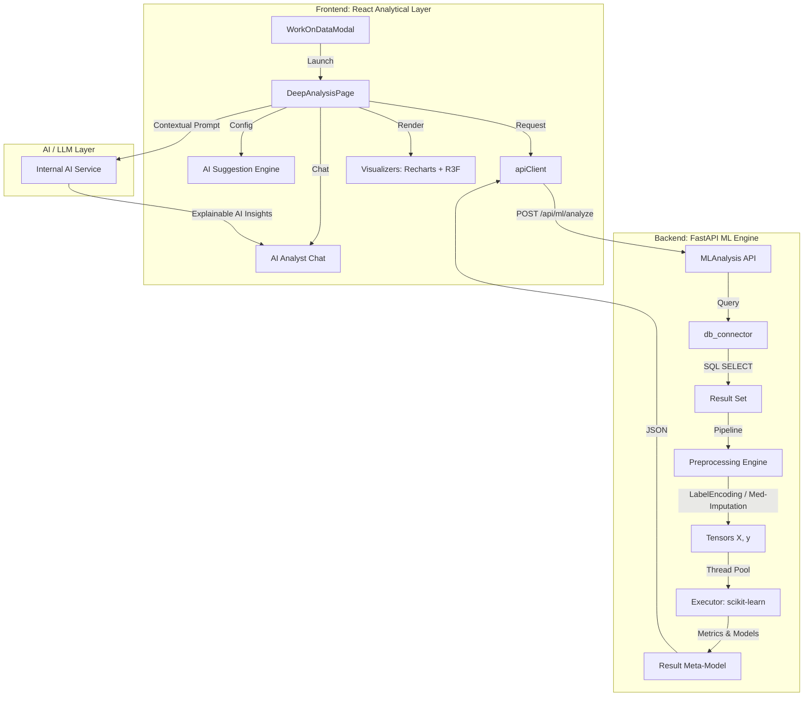

# 🧬 Work on Data: The Authoritative Analytical Intelligence Guide
## Version 1.1 — Technical Reference & Architectural Manual

---

## 1. Executive Summary
The **"Work on Data"** subsystem is the platform's primary bridge between raw database storage and predictive intelligence. While the main 3D graph (Valkyrie Engine) serves to visualize the *topological* relationships of a database, the "Work on Data" module is dedicated to the *statistical* and *predictive* relationships within the rows themselves.

It is a non-invasive, read-only analytical workbench that allows users to:
1.  **Extract** data samples securely.
2.  **Transform** heterogeneous database types into standardized ML-ready tensors.
3.  **Execute** state-of-the-art algorithms (Classification, Regression, Clustering, Forecasting).
4.  **Visualize** results in a high-fidelity "Deep Analysis" environment.
5.  **Interpret** findings via a context-aware AI Analyst Chat.

---

## 2. Technical Architecture Diagram (Mermaid)

---

## 3. The 4 Analytical Pillars

The platform categorizes all data science workflows into four mutually exclusive "Algorithm Families."

### 3.1 Classification Family (Supervised)
**Objective**: Predict a discrete category (Label) based on a set of independent features.

-   **Primary Algorithms**:
    -   **Random Forest (`rf_clf`)**: The gold standard for tabular data. It builds an ensemble of 100 decision trees to minimize overfitting. Best for mixed data types (Numeric + Categorical).
    -   **SVM (`svm`)**: Support Vector Machines. Finds the hyper-plane that maximizes the margin between classes. Excellent for smaller, high-dimensional datasets.
    -   **K-Nearest Neighbors (`knn`)**: Classifies points based on the majority label of their $k$ closest neighbors in feature space.
    -   **Logistic Regression (`logreg`)**: A baseline probabilistic model for binary or multi-class classification. Highly interpretable coefficients.

-   **Evaluation Metrics**:
    -   **Accuracy**: The ratio of correct predictions to total predictions.
    -   **F1-Score**: The harmonic mean of Precision and Recall. Essential for imbalanced datasets.
    -   **Recall**: Ability of the model to find all positive samples (Sensitivity).
    -   **Precision**: Accuracy of the positive predictions.

### 3.2 Regression Family (Supervised)
**Objective**: Predict a continuous numeric value (Quantity).

-   **Primary Algorithms**:
    -   **XGBoost / Gradient Boosting (`xgboost`)**: A sequential ensemble method that builds weak learners (trees) to correct the errors of previous ones. It is the platform's highest-performing regressor.
    -   **Linear Regression (`linear`)**: The fundamental baseline. Fits a straight line to the data using Least Squares.
    -   **Ridge / Lasso (`ridge`, `lasso`)**: Regularized linear models that penalize large coefficients to prevent overfitting and perform implicit feature selection.

-   **Evaluation Metrics**:
    -   **$R^2$ (Coefficient of Determination)**: The proportion of variance in the dependent variable that is predictable from the independent variables (Range: 0.0 – 1.0).
    -   **RMSE (Root Mean Square Error)**: The standard deviation of the residuals. Penalizes large errors heavily.
    -   **MAE (Mean Absolute Error)**: The average absolute difference between predicted and actual values. More robust to outliers than RMSE.

### 3.3 Time Series Family (Temporal Forecasting)
**Objective**: Predict future values based on past chronological observations.

-   **Platform Implementation**:
    The platform uses a custom **Harmonic Regression** model that decomposes the series into **Linear Trend** ($y = mx + b$) and **Seasonal Periodicity** (Weekly/Monthly cycles) via Fourier transforms of residuals.

-   **Features**:
    -   **30-Day Forecast**: Extrapolates the learned trend and seasonal pulses into the future.
    -   **Confidence Intervals**: Calculated based on the standard deviation of historical residuals, widening as the forecast horizon increases.
    -   **Monthly Growth Rate**: Automatically computed percentage indicating the directional momentum of the data.

### 3.4 Clustering Family (Unsupervised)
**Objective**: Group similar records together based on spatial proximity without a predefined target.

-   **Primary Algorithms**:
    -   **K-Means (`kmeans`)**: Partitions data into $k$ clusters. The platform uses **Auto-K Selection** by maximizing the **Silhouette Score** across K=2 to K=10.
    -   **DBSCAN (`dbscan`)**: Density-Based Spatial Clustering of Applications with Noise. It identifies clusters of arbitrary shapes and explicitly flags "Noise" points (outliers) that do not belong to any cluster.

-   **Evaluation Metrics**:
    -   **Silhouette Score**: Measures how similar an object is to its own cluster compared to other clusters ($a/b$ ratio).
    -   **Centroid Separation**: Calculates the variance between the means of different clusters to determine feature distinctness.

---

## 4. The Intelligence Pipeline: From SQL to Tensors

The transformation process inside `backend/app/api/ml_analysis.py` is a 4-stage assembly line:

### Stage 1: Secure Ingestion
-   A `SELECT` query is generated using **safe-quoting** to prevent SQL injection.
-   Data is capped at **2,000 – 5,000 rows** to ensure the analysis completes in under 2 seconds.
-   Numerical and categorical columns are isolated based on database metadata types.

### Stage 2: Feature Engineering & Preprocessing
Raw database data is often "dirty." The platform applies the following automatic corrections:
1.  **Imputation**: Missing numeric values are filled with the **Median**. Missing categorical values are filled with the string `"__missing__"`.
2.  **Harmonization**: Date-time columns are converted into UNIX timestamps or periodic day-of-week integers.
3.  **Encoding**: Categorical strings are converted into integers via `LabelEncoder`.
4.  **Tensors**: All data is packed into **NumPy Ndarrays** ($X$ for features, $y$ for target).

### Stage 3: Multi-Threaded Execution
To prevent a heavy ML training task from freezing the web server, the platform uses the Python `asyncio` loop's `run_in_executor`. This offloads the CPU-intensive `scikit-learn` training to a background thread pool.

### Stage 4: Insight Generation
Once the model is trained, the platform doesn't just return numbers. It generates **Natural Language Insights**:
-   *"Feature 'X' accounts for 45% of the model's decision-making."*
-   *"The model shows strong generalization with an F1-score of 0.88."*
-   *"Outliers detected in cluster 'B' suggest data quality issues in 'Y' column."*

---

## 5. Frontend Deep Analysis Interface

The `/deep-analysis` page is a React-rendered high-performance dashboard that visualizes the meta-model returned by the backend.

### 5.1 2D Scatter & Relationship Plots
Using **Recharts**, the platform maps clusters or prediction error bands onto a 2D plane.
-   **Color Mapping**: Tied to cluster ID or classification label.
-   **Interactive Tooltips**: Hovering over a dot reveals the raw database row values, providing immediate context to the statistical point.

### 5.2 3D Point Cloud (WebGL)
For high-density clustering, the platform uses **React-Three-Fiber**.
-   **Dimensionality**: Features are projected onto X, Y, and Z axes.
-   **Navigation**: Orbit, zoom, and pan allow users to "fly through" their data to see if clusters are well-separated or overlapping.

### 5.3 AI Analyst Chat (The "Brain")
The AI chat is not a generic LLM. It is fed specific "state context":
-   **Temperature**: 0.2 (deterministic and analytical).
-   **Input**: The raw metrics from the scikit-learn output + the feature naming mapping.
-   **Function**: It acts as a **Natural Language Interface to Statistics**. You don't need to know what "Heteroscedasticity" is; you just ask the AI: *"Is my model biased?"*

---

## 6. Mathematical Formulas (The "Engine Room")

### 6.1 Feature Importance ($I$)
For Tree-based models (Random Forest, XGBoost), importance is calculated as the total reduction of the criterion (Gini or Entropy) brought by that feature.
$$Importance(f) = \sum_{n \in nodes(f)} \frac{N_n}{N} \times (G_n - \frac{N_{n,L}}{N_n}G_{n,L} - \frac{N_{n,R}}{N_n}G_{n,R})$$

### 6.2 Seasonal Harmonic Decomposition
For timeseries, we fit a series of sinusoids to the residuals $\epsilon$:
$$Seasonality = \sum_{k=1}^3 [a_k \cos(\frac{2\pi k t}{T}) + b_k \sin(\frac{2\pi k t}{T})]$$
Where $T=7$ for weekly patterns.

### 6.3 Silhouette Score ($S$)
$$s(i) = \frac{b(i) - a(i)}{\max\{a(i), b(i)\}}$$
Where $a(i)$ is the average distance to other points in the same cluster, and $b(i)$ is the average distance to the nearest neighbor cluster.

---

## 7. Operational Safety & Read-Only Policy
The platform strictly adheres to a **Zero-Write Policy**:
1.  **SQL Isolation**: Only `SELECT` statements are executed.
2.  **No Temporary Tables**: Analysis is done entirely in server memory (RAM), never spilling back to the database.
3.  **Low Impact**: Sampling ensures that production OLTP performance is unaffected even during complex clustering tasks.

---

## 8. Summary of Components Mapping
| File | Responsibility |
| :--- | :--- |
| `backend/app/api/ml_analysis.py` | Training, Preprocessing, Metrics, Insights. |
| `frontend/src/components/Dashboard/WorkOnDataModal.jsx` | Interaction configuration, AI Suggestion UI. |
| `frontend/src/components/Dashboard/DeepAnalysisPage.jsx` | Standalone full-screen visualization & AI Chat. |
| `frontend/src/utils/apiClient.js` | WebSocket and REST bridging. |

---

## 9. Future Roadmap: Predictive 3D Simulation
In Version 2.0, the "Work on Data" outcomes will be projected back onto the main Valkyrie 3D graph, allowing users to see "Predicted Future States" where nodes change size and position based on the ML models' multi-day forecasts.

---
**Living Data Intelligence Platform — Modernizing the Data Stack via Spatial AI.**
