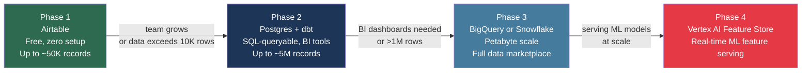
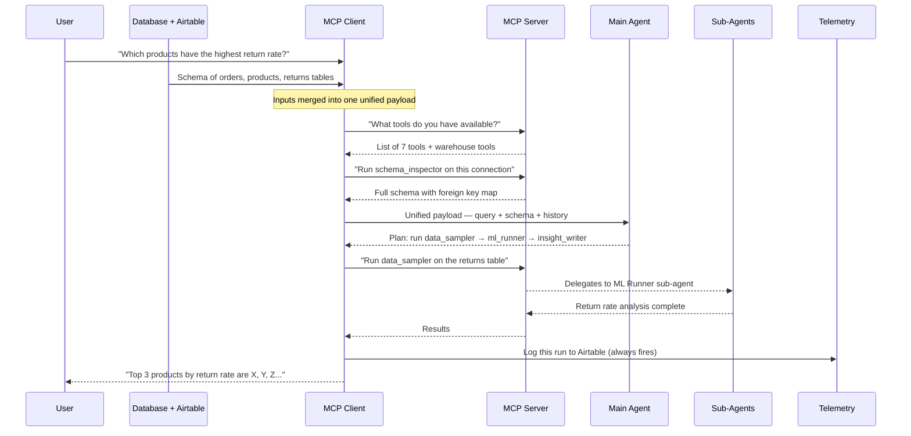
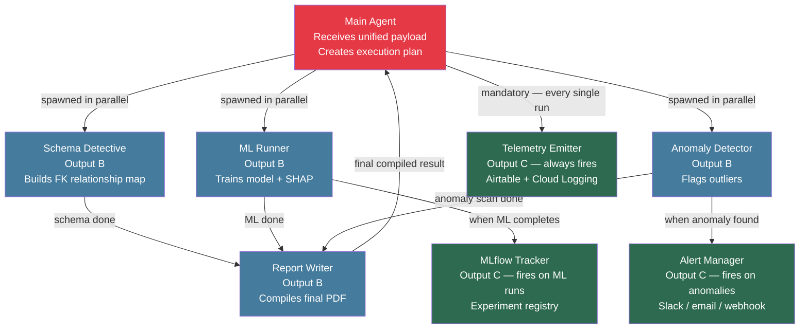
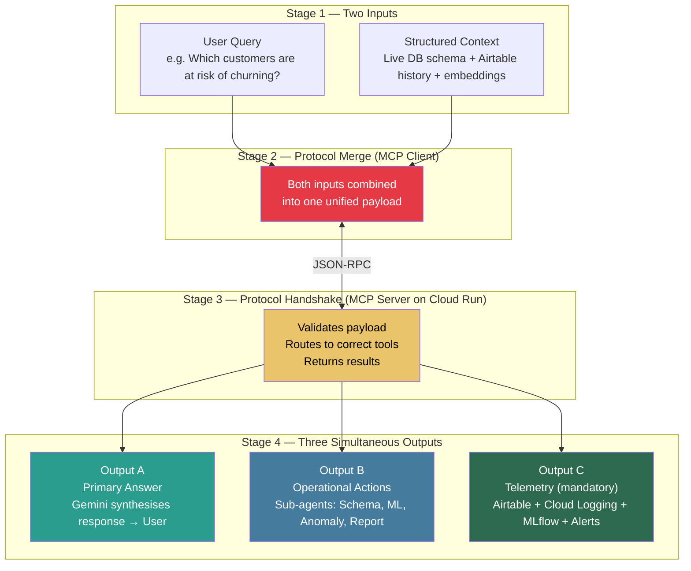

# Living Data Intelligence Platform
## Architecture Reference — 5 Steps

---

## How the System Works

Think of the platform like a **smart analyst team** that gets called in every time a user asks a question about their database.

The request goes through four stages:

```
Stage 1 — Two inputs arrive
          The user's question  +  What the system already knows about the database
                    ↓
Stage 2 — Both inputs are merged into one unified request
                    ↓
Stage 3 — The unified request is routed to the right tools
                    ↓
Stage 4 — Three things happen at the same time:
          [A] The main answer is generated and sent to the user
          [B] A background action is triggered (e.g. write result to database)
          [C] A telemetry record is logged (audit trail, metrics, experiment log)
```

> Outputs A, B, and C always fire together. Telemetry (C) is mandatory — it cannot be turned off, because without it there is no audit trail and no way to debug failures in production.

---

## GCP Services at Each Stage

| Stage | What Happens | GCP Service Used |
|---|---|---|
| Input A — User Query | User types a natural language question | Cloud Pub/Sub, Vertex AI Agent Builder |
| Input B — Structured Context | System pulls live DB schema + historical records | Vertex AI Vector Search, BigQuery, Airtable |
| Stage 2 — Merge | MCP Client combines both inputs into one payload | Cloud Run (client container) |
| Stage 3 — Route | MCP Server validates payload and routes to the right tool | Cloud Run or GKE |
| Output A — Answer | Main Agent generates the response using Gemini | Vertex AI Gemini 1.5 Pro |
| Output B — Action | Sub-agent writes a result to a database or calls a webhook | Cloud Functions, Cloud Spanner |
| Output C — Telemetry | Telemetry sub-agent logs the run to Airtable and Cloud Logging | Cloud Logging, Vertex AI MLOps, Airtable |

---

## Step 1 — Database Layer

### What It Is

The database layer is the **foundation of everything**. It is where the raw operational data lives — the actual tables, columns, rows, foreign key relationships, and transaction history that the AI reads and reasons about.

Without a connected database, the platform has nothing to work with. Every insight, every ML result, every anomaly report — all of it originates here.

### What the Platform Does with the Database

The platform never modifies the database during analysis. It only reads from it. Specifically it:

- **Inspects the schema** — what tables exist, what columns they have, how tables relate to each other via foreign keys
- **Samples the data** — takes a statistically representative slice of rows to understand what the data actually looks like
- **Runs models** — trains ML models on the sampled data to find patterns and make predictions
- **Detects anomalies** — looks for statistical outliers, missing values, duplicates, or unexpected spikes

### Real-World Example

> A retail company connects their PostgreSQL database which has tables like `orders`, `customers`, `products`, and `returns`.
>
> The user types: *"Which products have the highest return rate this quarter?"*
>
> The platform reads the `orders` and `returns` tables, joins them on `order_id`, calculates return rates per product, and presents the top 10 worst-performing products — all without writing a single line of SQL manually.

### Supported Databases

| Database | Best For |
|---|---|
| PostgreSQL | Primary production workloads |
| MySQL | Legacy systems and vendor databases |
| Neon (Serverless Postgres) | Development, staging, auto-scales to zero |
| SQLite | Local development, embedded agent memory |
| MongoDB | Unstructured and document-based data *(coming soon)* |

### The 7 Intelligence Tools

The platform exposes seven specialised tools that it can call against any connected database:

| Tool | What It Does | Example Use |
|---|---|---|
| **Schema Inspector** | Reads all tables, columns, data types, foreign key links | "Show me how the orders table connects to customers" |
| **Data Sampler** | Takes a representative sample of rows | "Give me a sense of what the sales data looks like" |
| **ML Runner** | Trains a classification or regression model on table data | "Predict which customers are likely to churn" |
| **Anomaly Detector** | Finds statistical outliers in a column | "Flag any unusual spikes in transaction amounts" |
| **Insight Writer** | Summarises findings in plain English | "Explain what the ML model found in simple terms" |
| **Action Trigger** | Fires a downstream action — webhook, write, notification | "Write the anomaly summary to the alerts table" |
| **Query Builder** | Converts a natural language question into SQL | "How many orders were placed last month?" |

### Key Design Principles

| Principle | Why It Matters |
|---|---|
| **Connection pooling** | Allows multiple tools to query the database at the same time without conflicts |
| **Read-only during analysis** | The agent never accidentally alters production data while it is reasoning about it |
| **Schema caching (5-minute TTL)** | Avoids re-reading the full schema on every request — significantly faster for large databases |
| **Isolated per connection ID** | Each registered database is fully namespaced — one customer's database never bleeds into another's |

---

## Step 2 — Data Warehouse (Starting with Airtable)

### What It Is

The data warehouse is the platform's **operational memory**. It does not store raw business data (that stays in the customer's database). Instead it stores records *about the platform's own activity*:

- Every time the agent ran and what it did
- Historical snapshots of database schemas (to detect when schemas change)
- ML experiment results (which model ran, what accuracy it got)
- Detected anomalies and whether they were resolved
- Data quality scores over time
- A task queue tracking every sub-agent job

### Why Start with Airtable

A full enterprise data warehouse like BigQuery or Snowflake is powerful but requires significant setup, cost, and DevOps knowledge. Airtable gives you **80% of the value with 0% of the infrastructure**:

- It is a visual spreadsheet that anyone on the team can open and understand
- It has a built-in REST API — the platform can write to it and read from it programmatically
- It supports webhooks — when a new record is created, it can automatically trigger an action
- It is free to start

### Real-World Example

> A data engineering team uses the platform to monitor a PostgreSQL database daily.
>
> Every morning, the agent runs automatically, inspects the schema, samples key tables, and detects anomalies. All of this is invisible to the team until something goes wrong.
>
> When an anomaly is detected — say, the `revenue` column has 40% null values today vs 2% yesterday — the platform writes a record to the **Anomaly Registry** table in Airtable. The team lead opens Airtable, sees the alert, marks it as resolved after investigating, and the record is updated.
>
> A month later, the engineering manager wants to review how many anomalies were detected in Q2. They filter the Airtable Anomaly Registry by date — done in 30 seconds, no SQL required.

### Airtable Table Design

#### Agent Runs
*Records every time the agent ran — the complete audit trail*

| Field | What It Stores | Example Value |
|---|---|---|
| Run ID | Unique identifier for this run | `run_2026_07_04_001` |
| Timestamp | When the run started | `2026-07-04 08:32:11 UTC` |
| User Query | What the user asked | "Which customers haven't ordered in 90 days?" |
| Tools Called | Which tools the agent used | schema_inspector, data_sampler, query_builder |
| Latency | How long the run took | 4,230ms |
| Tokens Used | LLM token consumption | 1,847 |
| Status | Outcome | success / error / partial |

#### Schema Snapshots
*Tracks schema changes over time — detects drift*

| Field | What It Stores | Example Value |
|---|---|---|
| Connection ID | Which database | `prod-postgres-retail` |
| Snapshot Date | When it was taken | `2026-07-04` |
| Table Count | Number of tables at that time | 47 |
| Schema Hash | Fingerprint of the full schema | `a3f9c7...` |

> If today's hash differs from yesterday's, a new column or table was added or dropped — the team is alerted automatically.

#### ML Experiment Log
| Field | Example Value |
|---|---|
| Model Type | RandomForest Classification |
| Target Column | `churned` |
| Accuracy | 87.3% |
| Top SHAP Feature | `days_since_last_order` |
| Run By | Main Agent |

#### Anomaly Registry
| Field | Example Value |
|---|---|
| Table | `transactions` |
| Column | `amount_usd` |
| Anomaly Type | Value spike — 10x above rolling average |
| Severity | High |
| Detected At | `2026-07-03 14:22:00` |
| Resolved At | `2026-07-03 16:45:00` |

#### Data Quality Scores
| Field | Example Value |
|---|---|
| Table | `customers` |
| Null Percentage | 3.2% |
| Duplicate Rate | 0.1% |
| Freshness Score | 98 / 100 |
| Quality Grade | A |

#### Sub-Agent Task Queue
| Field | Example Value |
|---|---|
| Task ID | `task_ml_001` |
| Assigned Agent | `ml_runner` |
| Status | done |
| Latency | 12,400ms |
| Parent Run ID | `run_2026_07_04_001` |

### Warehouse Evolution Path

Start with Airtable. Graduate to a full warehouse when the data outgrows it.



---

## Step 3 — MCP Server & Client

### What It Is

MCP (Model Context Protocol) is the **universal communication layer** between any AI system and the platform's tools.

Think of it like a power socket standard. Before MCP, every AI application (Claude Desktop, Cursor, Vertex AI, custom apps) needed its own custom integration to talk to the platform. With MCP, you build the platform once, and any AI tool that supports MCP can plug in and use it immediately.

### The Problem It Solves

**Without MCP:**

```
Claude Desktop  →  custom plugin built just for Claude   →  your database tools
Vertex AI       →  different custom API built for Vertex  →  your database tools
Cursor          →  yet another integration built for Cursor →  your database tools
```

Each integration is bespoke. Three clients = three separate integrations to build and maintain.

**With MCP:**

```
Claude Desktop ──┐
Vertex AI      ──┤──  MCP Protocol (JSON-RPC)  ──→  MCP Server  ──→  all 7 platform tools
Cursor         ──┤
Custom App     ──┘
```

One server. Any client. No duplication.

### The Two Roles: Client and Server

#### MCP Client — The Merge Point

The MCP Client sits inside the AI host environment (e.g. Vertex AI Agent Builder or Claude Desktop). Its job is to:

1. Receive the user's raw query (Input A)
2. Pull the current database schema and Airtable history (Input B)
3. Merge both into a single, structured payload
4. Send that unified payload to the MCP Server

> **Example:** A user asks *"Are there any data quality issues in the customers table?"*
>
> The MCP Client takes this question, fetches the current schema of the `customers` table (column names, types, row count), pulls the last data quality score from Airtable, and bundles everything together. The agent now has the question *and* the full context it needs to answer it — before a single tool has been called.

#### MCP Server — The Routing Layer

The MCP Server receives the unified payload and acts as the traffic controller:

1. It exposes a list of available tools (the 7 platform tools + Airtable warehouse tools)
2. It receives tool call requests from the client
3. It validates the request, routes it to the correct tool handler
4. It returns the result back to the client

The MCP Server is deployed on **Cloud Run** — it scales to zero when idle and handles many concurrent requests during peak usage.

### How a Request Flows Through the MCP Layer



### Transport Options

The MCP protocol can run over different transport mechanisms depending on deployment:

| Transport | How It Works | When to Use |
|---|---|---|
| **stdio** | Communicates through standard input/output | Local development and CLI tools |
| **SSE (Server-Sent Events)** | One-way HTTP stream from server to client | Remote MCP servers on Cloud Run |
| **WebSocket** | Full two-way real-time connection | High-frequency real-time streaming |
| **HTTP Streamable** | Standard HTTP request/response | Serverless, stateless deployments |

---

## Step 4 — Main Agent

### What It Is

The Main Agent is the **central reasoning engine**. It is the brain of the platform. After the MCP Client has merged the inputs and the MCP Server has confirmed the available tools, the Main Agent takes over. It decides what to do, coordinates all the work, and produces the final answer.

The Main Agent uses **Gemini 1.5 Pro** (via Vertex AI) as its language model — giving it the ability to understand complex questions, reason over large amounts of data, and write clear, accurate natural language responses.

### What Happens Inside the Main Agent

The Main Agent has four internal components that run in sequence on every request:

#### 1. AgentPlanner — Figures Out What to Do

The planner reads the user's question, classifies the intent, and maps it to an ordered sequence of tool calls.

> **Example:** User asks *"Can you predict which of our customers are likely to stop buying from us?"*
>
> The planner classifies this as an `ml_predict` intent. It creates the following plan:
> - Step 1: Run `schema_inspector` to understand the customer table structure
> - Step 2: Run `data_sampler` to get a representative slice of data
> - Step 3: Run `ml_runner` (classification model, target = `churned`)
> - Step 4: Run `insight_writer` to explain the results in plain English
>
> It also detects that steps 1 and 2 do not depend on each other, so they can run in parallel — cutting the total time roughly in half.

#### 2. AgentExecutor — Does the Work

The executor takes the plan and runs it. It manages:

- **Dependency ordering** — step 3 (ML Runner) cannot start until step 2 (Data Sampler) is done
- **Parallelism** — steps that don't depend on each other run simultaneously
- **Error handling** — if a tool fails, it retries with adjusted parameters before giving up

#### 3. AgentMemory — Remembers the Conversation

The memory store keeps track of what has been discussed in the current session. This allows the agent to:

- Avoid re-reading the same schema twice in one conversation
- Understand follow-up questions in context (*"What about the returns table?"* — without re-stating the original question)
- Apply user preferences remembered from earlier in the session

> **Example:** The user earlier said *"I prefer metric names in human-readable format."* The memory stores this preference and the insight writer uses it for all subsequent outputs in the session.

#### 4. Gemini 1.5 Pro — Synthesises the Final Answer

After all tool results are collected, Gemini receives everything — the original question, the schema, the ML output, the anomaly scan results, the SHAP explanations — and synthesises it into a single, coherent natural language response.

> **Example output from Gemini:**
>
> *"Based on your customer data, 14.2% of customers show a high risk of churning. The strongest predictor is **days since last order** (contributing 38% of the model's decision weight), followed by **number of support tickets filed** (22%). I'd recommend targeting customers who haven't ordered in 60+ days and have filed more than 2 support tickets in the past quarter — that cohort represents 1,247 customers."*

### Intent Detection — How the Planner Maps Questions to Tools

| What the User Asks | Detected Intent | Tools Used |
|---|---|---|
| "What tables are in my database?" | `analyze` | schema_inspector → insight_writer |
| "Predict customer churn" | `ml_predict` | schema_inspector → data_sampler → ml_runner → insight_writer |
| "Are there any anomalies in my sales data?" | `anomaly` | data_sampler → anomaly_detector → insight_writer |
| "How many orders were placed last month?" | `query` | schema_inspector → query_builder |
| "Give me a full data quality report" | `report` | schema_inspector → data_sampler → ml_runner → anomaly_detector → insight_writer |

### GCP Service Mapping

| Agent Component | GCP Equivalent |
|---|---|
| Gemini 1.5 Pro reasoning | Vertex AI Generative AI |
| AgentPlanner (stateless compute) | Cloud Run |
| AgentExecutor (parallel execution) | Cloud Run concurrent request handling |
| AgentMemory (session storage) | Cloud Memorystore (Redis) |
| Schema cache | Cloud Spanner |
| Post-run telemetry write | Cloud Logging + Airtable API |

---

## Step 5 — Sub-Agents

### What They Are

Sub-agents are **focused, single-purpose workers** that the Main Agent spawns during execution. Each sub-agent is responsible for exactly one type of task. They can run in parallel when their tasks are independent of each other.

Sub-agents fall into two categories:

- **Action Sub-Agents** — produce Output B (the operational result: ML analysis, schema map, anomaly list, SQL query)
- **Telemetry Sub-Agents** — produce Output C (the audit trail: Airtable records, MLflow experiment logs, Cloud Logging entries)

### Why Sub-Agents Instead of One Big Agent?

| Approach | Problem |
|---|---|
| One large agent does everything sequentially | Slow. If step 3 fails, you restart from step 1. Hard to debug. |
| Multiple focused sub-agents | Fast (parallel). If one fails, only that agent retries. Each is independently testable. |

> **Example:** Running a full report (schema + ML + anomaly + write) without sub-agents might take 45 seconds. With sub-agents running the schema inspection, ML analysis, and anomaly detection in parallel, the same report completes in 15 seconds.

---

### Output B — Action Sub-Agents

#### Data Engineering Sub-Agents

| Sub-Agent | What It Does | Real-World Example |
|---|---|---|
| **Schema Detective** | Maps every table, column, data type, and foreign key relationship | *"Your `orders` table connects to `customers` via `customer_id`, and to `products` via `product_id`. There are 3 tables with no foreign key connections — potential orphans."* |
| **Data Profiler** | Measures null rates, unique counts, data type distributions, min/max values per column | *"The `phone_number` column is 34% null. The `email` column has 99.7% unique values — likely a valid primary identifier."* |
| **Quality Auditor** | Flags duplicates, referential integrity failures, type mismatches | *"Found 1,243 duplicate rows in `transactions` on the combination of (user_id, timestamp, amount). Referential integrity broken: 47 orders reference customer IDs that do not exist."* |
| **Migration Planner** | Detects schema drift and generates safe SQL scripts to resolve it | *"Column `discount_pct` was added to `orders` since last snapshot. Recommended: add index on this column if it will be used in WHERE clauses frequently."* |

#### Analytics Sub-Agents

| Sub-Agent | What It Does | Real-World Example |
|---|---|---|
| **Query Builder** | Converts a natural language question into a validated SQL query | *User: "How many customers placed more than 3 orders in the last 30 days?" → Agent generates correct JOIN + GROUP BY + HAVING query* |
| **ML Runner** | Trains a model on the sampled data, produces accuracy metrics and SHAP explanations | *"Churn prediction model: 87% accuracy. Top 3 features driving churn: (1) days since last order, (2) support tickets filed, (3) average order value decline."* |
| **Trend Analyst** | Identifies patterns and seasonality in time-series data | *"Sales peak every Friday. There is a consistent 30% drop in order volume the first week of each month. Forecast: next 4 weeks projected revenue is $420K ± $18K."* |
| **Report Writer** | Compiles all sub-agent findings into a single coherent PDF report | *Generates a 12-page PDF with executive summary, anomaly highlights, ML insights, data quality scorecard, and schema map — downloadable in one click* |

---

### Output C — Telemetry Sub-Agents

These sub-agents always fire after every run. They are not optional.

| Sub-Agent | What It Logs | Where It Logs | Why It Matters |
|---|---|---|---|
| **Telemetry Emitter** | Run ID, query, tools used, latency, token count, success/error status | Airtable Agent Runs + Cloud Logging | Full audit trail — who asked what, when, and how long it took |
| **MLflow Tracker** | Model type, parameters, accuracy, SHAP top features, dataset hash | MLflow Experiment Registry | Reproducibility — you can re-run any past ML experiment exactly |
| **Lineage Recorder** | Which tables were read, which columns were sampled, what was written | Lineage graph | Compliance — proves what data the AI touched and when |
| **Alert Manager** | Anomaly details, severity, affected table/column, recommended action | Slack / email / webhook | Immediate human notification when something needs attention |

> **Real-World Example — Why Mandatory Telemetry Matters:**
>
> A data analyst gets a churn prediction result on Monday. On Friday, the model's predictions look different. Without telemetry, there is no way to know whether the database changed, the model parameters changed, or the sampled data was different.
>
> With the MLflow Tracker and Lineage Recorder, the team can pull up the exact Monday run, see the exact rows that were sampled, the exact model parameters used, and the exact schema that existed at that time — and reproduce it precisely.

---

### How Sub-Agents Work Together



### Sub-Agent Task Queue (Airtable)

Every sub-agent task gets its own row in the **Sub-Agent Task Queue** table in Airtable. This gives full visibility into what every agent is doing at any point.

| Field | Example |
|---|---|
| Task ID | `task_ml_20260704_007` |
| Assigned Agent | `ml_runner` |
| Status | `done` |
| Input | `{table: "customers", model: "classification", target: "churned"}` |
| Output | `{accuracy: 0.873, top_feature: "days_since_last_order"}` |
| Error Log | *(empty — no errors)* |
| Latency | 12,400 ms |
| Parent Run ID | `run_2026_07_04_001` |

---

## Complete System Diagram



---

## End-to-End Example: One Full Request

> **User asks:** *"Give me a full data quality and churn risk report for the customers table."*

| Step | What Happens | Who Does It |
|---|---|---|
| 1 | User query arrives via REST API | Platform API layer |
| 2 | MCP Client pulls live schema of `customers` table | MCP Client + Schema Inspector |
| 3 | MCP Client pulls last 30-day quality scores from Airtable | MCP Client + Airtable |
| 4 | Both inputs merged into unified payload | MCP Client |
| 5 | MCP Server receives payload, confirms available tools | MCP Server |
| 6 | Main Agent classifies intent as `report` | AgentPlanner |
| 7 | Plan created: schema → sample → ML + anomaly → report | AgentPlanner |
| 8 | Schema Detective and Data Profiler run in parallel | Sub-agents (parallel) |
| 9 | ML Runner trains churn classification model | ML Runner sub-agent |
| 10 | Anomaly Detector scans all columns for outliers | Anomaly Detector sub-agent |
| 11 | Report Writer compiles schema map + quality scores + churn model + anomalies into PDF | Report Writer sub-agent |
| 12 | Gemini synthesises executive summary | Main Agent + Gemini 1.5 Pro |
| 13 | Answer and PDF link sent to user (Output A) | Platform API |
| 14 | Telemetry Emitter logs the full run to Airtable (Output C) | Telemetry sub-agent |
| 15 | MLflow Tracker records the churn model experiment (Output C) | MLflow sub-agent |
| 16 | Alert Manager sends Slack message: "3 high-severity anomalies found" (Output C) | Alert Manager sub-agent |
| **Total time** | **~15–20 seconds** | |

---

## Implementation Roadmap

| Phase | Timeline | What Gets Built |
|---|---|---|
| **Phase 1 — Foundation** | Now (Active) | Database connections, 7 core tools, agent planner + executor + memory, REST API, Airtable base setup |
| **Phase 2 — MCP Integration** | 2–4 weeks | MCP Server deployed on Cloud Run, MCP Client with context merge, all 7 tools exposed via MCP, Airtable as MCP-accessible warehouse |
| **Phase 3 — Multi-Agent** | 4–8 weeks | All sub-agents built and connected, CrewAI analytics crew, telemetry always-on, parallel execution working end-to-end |
| **Phase 4 — GCP Scale** | 8–16 weeks | Vertex AI Agent Builder as host, BigQuery replaces Airtable for scale, Vector Search for context, full Vertex AI MLOps integration |

---

*Living Data Intelligence Platform | Architecture Reference v4.0 | 2026-07-04*
